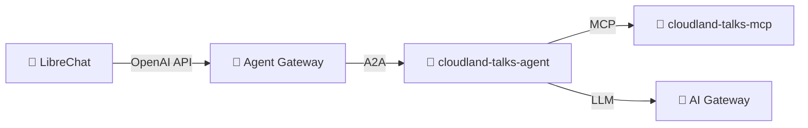

# Step 01: Deploy Your First AI Agent

Two parts:

- **A — Deploy the example agent.** Run a ready-made CloudLand-talks
  agent so you can see all the platform pieces wired together.
- **B — Author your own agent.** Fill in an `Agent` template that
  uses a provided weather MCP, and chat with the result.

Everything else (operators, AI gateway, agent gateway, monitoring,
LibreChat) is already running cluster-wide — see
[Step 00](../00-resource-and-platform-plane/).

---

## A · Deploy the example agent

A small agent that answers questions about the **CloudLand 2026
conference programme**. It demonstrates the core agentic-layer pieces:
an `Agent` (the LLM-driven brain), a `ToolServer` exposing an MCP
server it can call, and the auto-discovery onto the shared Agent
Gateway so LibreChat can talk to it.

### Apply

Open the three YAML files in this folder and **manually replace every
`<your-namespace>` with your namespace** (e.g. `ns-07`). Skim the rest
of each file while you're there — these are the manifests you're about
to deploy:

- `cloudland-talks-mcp.yaml` — a `ToolServer` pointing at the
  CloudLand-talks MCP server image.
- `cloudland-talks-agent.yaml` — the `Agent` itself: instructions,
  model, and which tools it can call.
- `kustomization.yaml` — bundles the two together so a single
  `kubectl apply` deploys them.

Then apply the bundled pair:

```bash
kubectl apply -k steps/01-agentic-layer-runtime
```

> The kustomization only includes the CloudLand-talks pair. The files
> for Part B (`weather-mcp.yaml`, `your-agent.yaml`) are *not* in the
> kustomization on purpose — apply them yourself when you get there.

Verify:

```bash
kubectl get agents,toolservers,toolroutes,pods -n $YOUR_NAMESPACE
```

Both pods should reach `Running` / `1/1 Ready` within ~60 seconds. If
something stays pending:

```bash
kubectl describe agent cloudland-talks-agent -n $YOUR_NAMESPACE
kubectl logs deployment/cloudland-talks-agent -n $YOUR_NAMESPACE
```

### Chat with the example agent

`kubectl port-forward` to LibreChat dies on every SSE close, so run it
in a retry loop:

```bash
while true; do
  KUBECTL_PORT_FORWARD_WEBSOCKETS=true \
    kubectl port-forward -n librechat svc/librechat-librechat 3080:3080
  sleep 1
done
```

Open <http://localhost:3080>, sign up with any email/password, pick the
**Agent Gateway** endpoint, and find your agent in the model list as
`$YOUR_NAMESPACE/cloudland-talks-agent`. Try:

> What AI talks are at CloudLand 2026?
>
> Which workshop is Felix Kampfer giving?

### What just happened



The operator turned your `Agent` / `ToolServer` YAML into Deployments +
Services, wired LLM calls to the shared AI Gateway (no API keys needed
in your namespace), registered the agent with the shared Agent Gateway
(because `exposed: true`), and auto-injected OTel so logs + traces show
up in Grafana.

---

## B · Author your own agent

Now write an `Agent` from scratch — well, almost. A weather MCP server
is provided; you bring the agent's brain.

### Step 1 — Apply the weather MCP

`weather-mcp.yaml` declares a `ToolServer` pointing at a pre-built
image that wraps the [Open-Meteo](https://open-meteo.com/) APIs (no
API key, no setup). Three tools: `geocode_city`, `get_current_weather`,
`get_forecast(city, days)`.

Replace `<your-namespace>` and apply:

```bash
kubectl apply -f steps/01-agentic-layer-runtime/weather-mcp.yaml
```

Verify the pod comes up:

```bash
kubectl get toolserver,pod -l app.kubernetes.io/name=weather-mcp -n $YOUR_NAMESPACE
```

### Step 2 — Fill in `your-agent.yaml`

Open `your-agent.yaml`. You'll see TODOs for:

- `metadata.name` — pick a memorable name (lowercase, hyphenated).
- `spec.model` — keep `gemini/gemini-2.5-flash` for the default, or
  switch to `gemini-2.5-flash-lite` (cheaper/faster) or
  `gemini-2.5-pro` (smarter/slower).
- `spec.description` — one sentence shown in dashboards.
- `spec.instruction` — the system prompt. **This is the agent's brain.**
  Replace the placeholder with three short sections: persona, tools,
  behaviour. The template includes a skeleton example.

Don't change `spec.tools` — it's already wired to `weather-mcp`.

When you're done:

```bash
kubectl apply -f steps/01-agentic-layer-runtime/your-agent.yaml
```

### Step 3 — Chat with it

Keep the LibreChat port-forward running. In the model dropdown look for
`$YOUR_NAMESPACE/<the name you chose>` and try prompts that exercise
each tool:

> What's the weather like in Reykjavík right now?
>
> Will I need an umbrella in Berlin this week?
>
> Compare the next 3 days in Tokyo and Singapore.

If it never calls a tool, sharpen the **Tools** section in your
`instruction:` — the LLM picks tools based on what your prompt tells
it to use. If it hallucinates weather, ask yourself whether your
instructions told it to *always* call the tool first.

### Iterate

Edit the `instruction` field, re-apply, and try again. The operator
restarts the agent pod with the new prompt baked in (~10s). You can
make the agent multilingual, opinionated, terse, formal — the system
prompt is your lever.

---

## Next

[Step 02 — Experiments](../02-experiments/): evaluate your agent
end-to-end with a testbench Experiment.
