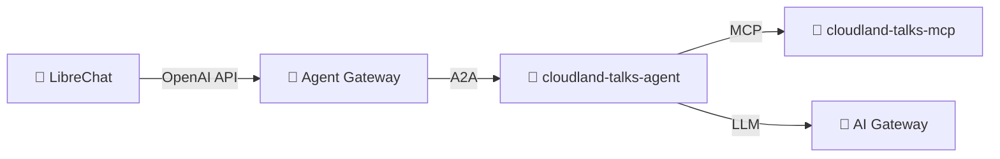

# Step 01: Deploy Your First AI Agent

You'll deploy a small agent that answers questions about the **CloudLand
2026 conference programme**. It demonstrates the core agentic-layer
pieces: an `Agent` (the LLM-driven brain), a `ToolServer` exposing an
MCP server it can call, and the auto-discovery onto the shared Agent
Gateway so LibreChat can talk to it.

Everything else (operators, AI gateway, agent gateway, monitoring, LibreChat)
is already running cluster-wide — see [Step 00](../00-resource-and-platform-plane/).

## Apply

Open the three YAML files in this folder and **manually replace every
`<your-namespace>` with your namespace** (e.g. `ns-07`). Skim the rest
of each file while you're there — these are the manifests you're about
to deploy:

- `cloudland-talks-mcp.yaml` — a `ToolServer` pointing at the
  CloudLand-talks MCP server image.
- `cloudland-talks-agent.yaml` — the `Agent` itself: instructions,
  model, and which tools it can call.
- `kustomization.yaml` — bundles the two together so a single
  `kubectl apply` deploys them.

Then apply the whole folder:

```bash
kubectl apply -k steps/01-agentic-layer-runtime
```

Verify:

```bash
kubectl get agents,toolservers,toolroutes,pods -n $YOUR_NAMESPACE
```

Both pods should reach `Running` / `1/1 Ready` within ~60 seconds. If
something stays pending:

```bash
kubectl describe agent cloudland-talks-agent -n $YOUR_NAMESPACE
kubectl logs deployment/cloudland-talks-agent -n $YOUR_NAMESPACE
```

## Chat with your agent

`kubectl port-forward` to LibreChat dies on every SSE close, so run it
in a retry loop:

```bash
while true; do
  KUBECTL_PORT_FORWARD_WEBSOCKETS=true \
    kubectl port-forward -n librechat svc/librechat-librechat 3080:3080
  sleep 1
done
```

Open <http://localhost:3080>, sign up with any email/password, pick the
**Agent Gateway** endpoint, and find your agent in the model list as
`$YOUR_NAMESPACE/cloudland-talks-agent`. Try:

> What AI talks are at CloudLand 2026?
>
> Which workshop is Felix Kampfer giving?

## What's happening



The operator turned your `Agent` / `ToolServer` YAML into Deployments +
Services, wired LLM calls to the shared AI Gateway (no API keys needed
in your namespace), registered the agent with the shared Agent Gateway
(because `exposed: true`), and auto-injected OTel so logs + traces show
up in Grafana.

## Next

[Step 02 — Experiments](../02-experiments/): evaluate your agent
end-to-end with a testbench Experiment.
