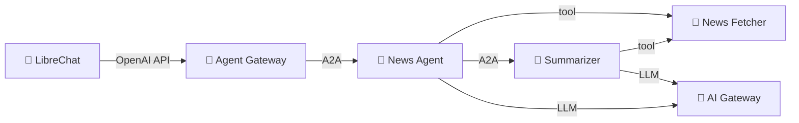

# Step 01: Deploy Your First AI Agents

You'll deploy into `$YOUR_NAMESPACE`:

- **News Agent** + **Summarizer Agent** — `Agent` resources
- **News Fetcher** — a `ToolServer` (MCP) exposed via a `ToolRoute`

Everything else (operators, AI gateway, agent gateway, monitoring, LibreChat)
is already running cluster-wide — see [Step 00](../00-resource-and-platform-plane/).

## Apply

Skim the manifests in [`showcase-news/`](showcase-news/), then replace the
namespace placeholder and apply:

```bash
sed -i "s/<your-namespace>/$YOUR_NAMESPACE/g" steps/01-agentic-layer-runtime/showcase-news/*.yaml
kubectl apply -k steps/01-agentic-layer-runtime/showcase-news
```

> macOS outside a Codespace: use `sed -i '' …` (BSD sed).

Verify:

```bash
kubectl get agents,toolservers,toolroutes,pods -n $YOUR_NAMESPACE
```

Three pods should reach `Running`. If one doesn't:

```bash
kubectl describe agent news-agent -n $YOUR_NAMESPACE
kubectl logs deployment/news-agent -n $YOUR_NAMESPACE
```

## Chat with your agent

```bash
kubectl port-forward -n librechat svc/librechat-librechat 3080:3080
```

Open <http://localhost:3080>, sign up with any email/password, pick the
**Agent Gateway** endpoint, and find your agent in the model list as
`$YOUR_NAMESPACE/news-agent`. Try:

> What's the latest news in AI? Summarize the top article.

## What's happening



The operator turned your `Agent` / `ToolServer` YAML into Deployments + Services,
wired LLM calls to the shared AI Gateway (no API keys needed in your namespace),
registered the news-agent with the shared Agent Gateway (because `exposed: true`),
and auto-injected OTel so logs + traces show up in Grafana.

## Next

[Step 02 — Agent Gateway](../02-agent-gateway/): see how the gateway discovered
your agent.