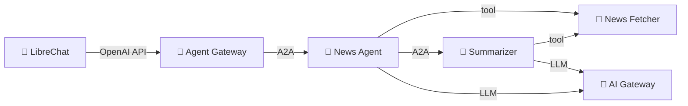

# Step 01: Deploy Your First AI Agents

Two self-contained showcases — pick whichever interests you, or do both:

- [`showcase-news/`](showcase-news/) — a **multi-agent** demo: news-agent
  delegates summarization to a sub-agent and calls an MCP news fetcher.
- [`showcase-cloudland-talks/`](showcase-cloudland-talks/) — a **single agent
  with multiple tools** demo: an agent that answers questions about the
  CloudLand 2026 conference programme.

Everything else (operators, AI gateway, agent gateway, monitoring, LibreChat)
is already running cluster-wide — see [Step 00](../00-resource-and-platform-plane/).

## Apply

Open the YAML files in your chosen showcase folder (e.g.
`showcase-news/news-agent.yaml`) and **manually replace every
`<your-namespace>` with your namespace** (e.g. `ns-07`). Skim the rest of
each file while you're there — these are the manifests you're about to deploy.

Then apply the whole folder:

```bash
kubectl apply -k steps/01-agentic-layer-runtime/showcase-news
```

For the CloudLand-talks showcase, swap `showcase-news` → `showcase-cloudland-talks`.

Verify:

```bash
kubectl get agents,toolservers,toolroutes,pods -n $YOUR_NAMESPACE
```

All pods should reach `Running` / `1/1 Ready` within ~60 seconds. If one
doesn't:

```bash
kubectl describe agent news-agent -n $YOUR_NAMESPACE
kubectl logs deployment/news-agent -n $YOUR_NAMESPACE
```

## Chat with your agent

`kubectl port-forward` to LibreChat dies on every SSE close, so run it in a
retry loop:

```bash
while true; do
  KUBECTL_PORT_FORWARD_WEBSOCKETS=true \
    kubectl port-forward -n librechat svc/librechat-librechat 3080:3080
  sleep 1
done
```

Open <http://localhost:3080>, sign up with any email/password, pick the
**Agent Gateway** endpoint, and find your agent in the model list under
`$YOUR_NAMESPACE/...`. Try:

> What's the latest news in AI? Summarize the top article.   <!-- news-agent -->
> What AI talks are at CloudLand 2026?                        <!-- cloudland-talks-agent -->

## What's happening



The operator turned your `Agent` / `ToolServer` YAML into Deployments + Services,
wired LLM calls to the shared AI Gateway (no API keys needed in your namespace),
registered the news-agent with the shared Agent Gateway (because `exposed: true`),
and auto-injected OTel so logs + traces show up in Grafana.

## Next

[Step 02 — Experiments](../02-experiments/): evaluate your agent end-to-end
with a testbench Experiment.