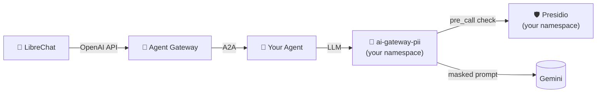

# Step 03: PII Protection with Presidio

In Step 01 your agent talked to the cluster-wide AI Gateway, which passes
prompts straight through to Gemini. In this step you'll stand up **your
own** AI Gateway in your namespace with a Presidio PII guardrail in front
of the LLM call. Then you'll switch your agent over and watch the
difference in the LLM response.



Prereq: [Step 01](../01-agentic-layer-runtime/) — one of the showcase
agents (e.g. `cloudland-talks-agent`) is running in `$YOUR_NAMESPACE`.

## What you're deploying

Three resources, all in your namespace:

- **`presidio.yaml`** — the Presidio analyzer/anonymizer service
  (`ghcr.io/agentic-layer/presidio`). A small Flask app that exposes
  `/analyze` and `/anonymize` over HTTP.
- **`ai-gateway-pii.yaml`** — a multi-doc file containing:
  - a `GuardrailProvider` pointing the gateway at your Presidio service,
  - a `Guard` declaring which entity types to detect, what threshold, and
    whether to `MASK` or `BLOCK` each one,
  - an `AiGateway` (LiteLLM) named `ai-gateway-pii` with the `pii-guard`
    attached in `spec.guardrails`.

Skim each file in [`pii-stack/`](pii-stack/). The interesting field is
`Guard.spec.presidio.entityActions` — that's where you decide which
PII categories get masked vs. blocked.

## Apply

Open every file in `pii-stack/` and replace `<your-namespace>` with your
namespace (same flow as Step 01). Then:

```bash
kubectl apply -k steps/03-pii-protection/pii-stack
```

Wait for everything to come up:

```bash
kubectl get aigateway,guard,guardrailprovider,pods -n $YOUR_NAMESPACE
```

You should see `presidio-…` and `ai-gateway-pii-…` pods reaching
`1/1 Ready`. The `AiGateway` and `Guard` should both show `Ready`.

## Switch your agent over

Open your showcase agent file from Step 01 (e.g.
`steps/01-agentic-layer-runtime/showcase-cloudland-talks/cloudland-talks-agent.yaml`)
and add an `aiGatewayRef` to its `spec`:

```yaml
spec:
  aiGatewayRef:
    name: ai-gateway-pii    # name only — defaults to the agent's own namespace
  # … existing fields …
```

Re-apply:

```bash
kubectl apply -k steps/01-agentic-layer-runtime/showcase-cloudland-talks
```

The operator restarts the agent pod with the new gateway URL baked in.

## Compare

Port-forward LibreChat (or keep your Step 01 forward running), pick the
**Agent Gateway** endpoint, and chat with the same agent — first with
PII-clean prompts, then with prompts that contain PII:

| Try | Expected |
|---|---|
| `Was sind die heutigen News?` | normal answer (no PII triggered) |
| `Mein Name ist Klaus Müller, ich wohne in Berlin, meine E-Mail ist klaus@example.com — fasse das zusammen.` | LLM sees `<PERSON>`, `<LOCATION>`, `<EMAIL_ADDRESS>` placeholders; response refers to the user by those tokens |
| `Meine Kreditkarte ist 4111-1111-1111-1111` | request is **blocked** before reaching the LLM — LibreChat surfaces the Guard's rejection |

> Presidio's German NLP model is picky about PERSON detection — give it a
> clear introduction (`Mein Name ist …`) to maximise the recall.

To confirm what reached the LLM, look at the new gateway's logs:

```bash
kubectl logs -n $YOUR_NAMESPACE deployment/ai-gateway-pii --tail=200 | grep -iE "presidio|guard|mask|block"
```

Switch the agent back to the platform gateway by setting
`spec.aiGatewayRef.name: ai-gateway` (and adding `namespace: ai-gateway`)
to see the unmasked round-trip side-by-side.

## Tweak the policy

In `ai-gateway-pii.yaml`, edit `Guard.spec.presidio`:

- `language` — Presidio's analyzer is language-specific (`de`, `en`, …).
- `scoreThresholds.ALL: "0.7"` — confidence threshold (0–1). Lower =
  more aggressive, more false positives.
- `entityActions` — the keys also determine which entities are even
  detected. Drop `LOCATION: MASK` and Presidio won't redact cities.

Re-apply `kubectl apply -k steps/03-pii-protection/pii-stack`. The Guard
is hot-reloaded by the gateway; no agent restart needed.

## Next

[Step 04 — Extras](../04-extras/) — GitOps with Flux, alternative agentic
UIs (Flowise, Langflow).
