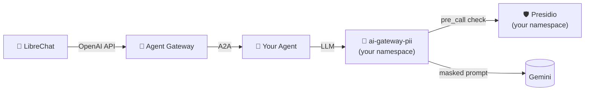

# Step 03: PII Protection with Presidio

In Step 01 your agent talked to the cluster-wide AI Gateway, which passes
prompts straight through to Gemini. In this step you'll stand up **your
own** AI Gateway in your namespace with a Presidio PII guardrail in front
of the LLM call. Then you'll switch your agent over and watch the
difference in the LLM response.



Prereq: [Step 01](../01-agentic-layer-runtime/) — the
`cloudland-talks-agent` is running in `$YOUR_NAMESPACE`.

## What you're deploying

Three resources, all in your namespace:

- **`presidio.yaml`** — the Presidio analyzer/anonymizer service
  (`ghcr.io/agentic-layer/presidio`). A small Flask app that exposes
  `/analyze` and `/anonymize` over HTTP.
- **`ai-gateway-pii.yaml`** — a multi-doc file containing:
  - a `GuardrailProvider` pointing the gateway at your Presidio service,
  - a `Guard` declaring which entity types to detect, what threshold, and
    whether to `MASK` or `BLOCK` each one,
  - an `AiGateway` (LiteLLM) named `ai-gateway-pii` with the `pii-guard`
    attached in `spec.guardrails`.

Skim each file in [`pii-stack/`](pii-stack/). The interesting field is
`Guard.spec.presidio.entityActions` — that's where you decide which
PII categories get masked vs. blocked.

## Apply

Open every file in `pii-stack/` and replace `<your-namespace>` with your
namespace (same flow as Step 01). Then:

```bash
kubectl apply -k steps/03-pii-protection/pii-stack
```

Wait for everything to come up:

```bash
kubectl get aigateway,guard,guardrailprovider,pods -n $YOUR_NAMESPACE
```

You should see `presidio-…` and `ai-gateway-pii-…` pods reaching
`1/1 Ready`. The `AiGateway` and `Guard` should both show `Ready`.

## Switch your agent over

Open `steps/01-agentic-layer-runtime/cloudland-talks-agent.yaml` and
change the `spec.aiGatewayRef` to point at your in-namespace gateway:

```yaml
spec:
  aiGatewayRef:
    name: ai-gateway-pii    # name only — defaults to the agent's own namespace
  # … existing fields …
```

Re-apply:

```bash
kubectl apply -k steps/01-agentic-layer-runtime
```

The operator restarts the agent pod with the new gateway URL baked in.

## Compare

Port-forward LibreChat (or keep your Step 01 forward running), pick the
**Agent Gateway** endpoint, and chat with the same agent.

### 1. BLOCK — the visible demo

```
Meine Kreditkarte ist 4111-1111-1111-1111. Bitte bestätige.
```

The request is rejected before reaching the LLM. LibreChat surfaces:

> `Blocked entity detected: CREDIT_CARD by Guardrail: pii-guard.`

### 2. MASK — transparent by design, verify via Tempo

```
Mein Name ist Klaus Müller, ich wohne in Berlin. Schreibe mir einen kurzen Gruß.
```

The response looks *normal* — it greets you as Klaus. **That's not a
bug.** LiteLLM's Presidio integration runs a round trip:

1. **Pre-call**: mask matched entities → the LLM receives
   `Mein Name ist <PERSON_1>, ich wohne in <LOCATION_1>. …`
2. **Post-call**: restore the placeholders back to the originals before
   the response leaves the gateway.

So the LLM never sees your PII, but your UX is unchanged. To **prove**
masking happened, open the trace for that request:

1. Port-forward Grafana, open the **Explore** view → pick the **Tempo**
   datasource.
2. Run a TraceQL query scoped to your gateway:
   ```traceql
   { resource.service.name = "ai-gateway-pii" }
   ```
3. Click into the most recent trace → expand the
   **`Received Proxy Server Request`** span (the root).
4. Look at these attributes:
   - **`gen_ai.input.messages`** — the prompt as it reached Gemini.
     You'll see `<PERSON_1>`, `<LOCATION_1>` instead of `Klaus Müller`
     and `Berlin`.
   - **`metadata.applied_guardrails`** — confirms `pii-guard` fired.
5. Expand the **`guardrail`** child spans for the per-entity detection
   results (entity type, score, span offsets).

> Presidio's German NLP model is picky about PERSON detection — give it
> a clear introduction (`Mein Name ist …`) to maximise recall.

### 3. Switch back

To see the un-guarded round-trip for comparison, set
`spec.aiGatewayRef.name: ai-gateway` (with `namespace: ai-gateway`)
and re-apply.

## Tweak the policy

In `ai-gateway-pii.yaml`, edit `Guard.spec.presidio`:

- `language` — Presidio's analyzer is language-specific (`de`, `en`, …).
- `scoreThresholds.ALL: "0.7"` — confidence threshold (0–1). Lower =
  more aggressive, more false positives.
- `entityActions` — the keys also determine which entities are even
  detected. Drop `LOCATION: MASK` and Presidio won't redact cities.

Re-apply `kubectl apply -k steps/03-pii-protection/pii-stack`. The Guard
is hot-reloaded by the gateway; no agent restart needed.

## Next

[Step 04 — Extras](../04-extras/) — GitOps with Flux, alternative agentic
UIs (Flowise, Langflow).
